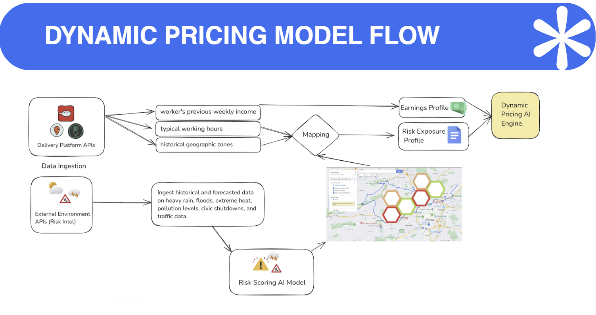

# AI-Powered Parametric Insurance for Delivery Partners

A parametric insurance platform that protects gig delivery workers from **income loss caused by external disruptions** such as heavy rain, floods, extreme heat, severe pollution, curfews, strikes, and sudden zone closures.

Unlike salaried workers, delivery partners do not get paid leave or income protection. Our platform fills that gap with **weekly insurance plans, hyperlocal risk prediction, automatic claim triggering, and fraud-aware validation**.

---

## Demo

[Download Demo](./demo.mp4)

## Problem

Platform-based delivery workers form the backbone of the modern digital economy, yet they remain financially exposed to external disruptions that reduce or completely stop their earning opportunities.

Delivery workers are highly exposed to external disruptions that can stop them from earning, but traditional insurance is not designed for:

| Challenge | Why It Matters |
|---|---|
| **Dynamic work schedules** | Workers do not have fixed shifts like salaried employees |
| **Fluctuating weekly income** | Income protection cannot rely on fixed salary assumptions |
| **Location-based risk** | Risk changes by zone, time, and disruption type |
| **Slow manual claims** | Workers need fast support when income stops immediately |

Existing protections mostly focus on accident or health coverage, not **loss of earning opportunity**.

---

## Vision & Solution

We build an **intelligent insurance orchestration layer** that acts as the smart middle layer between:

| Stakeholder | Role |
|---|---|
| **Delivery Platform** | Shares worker verification, activity, earnings, and location data through APIs. They must negotiate integration to expose login, earnings, and location access to enable the product to work without fraud. |
| **Insurance Provider** | Underwrites the policy, carries the actual financial risk, approves the insured rules, and collects premiums. |
| **Our Platform** | Calculates premiums, predicts risk, validates claims, detects fraud, and powers dashboards. It is the intelligent orchestration layer, not the insurer itself. |

Our platform handles:
- worker onboarding and verification
- weekly premium calculation
- disruption monitoring
- risk-zone classification
- safe-zone recommendations
- automatic claim initiation
- fraud detection
- insurer/admin dashboards

---

## Core Idea: Parametric Insurance

Instead of waiting for workers to manually prove exact income loss after an event, the system continuously monitors disruption indicators and automatically triggers claims when predefined conditions are met.

### Covered disruptions

| Disruption Type | Example Impact |
|---|---|
| Heavy rain / floods | Worker cannot safely operate in affected zones |
| Extreme heat | Unsafe outdoor delivery conditions |
| Severe pollution | Outdoor work becomes risky or restricted |
| Curfews / strikes | Movement restrictions reduce earning opportunity |
| Sudden zone closures | Market/area shutdown stops work unexpectedly |
| Traffic shutdowns | Routes become unusable, reducing workability |

The payout is based on verified disruption conditions and worker eligibility, not on traditional reimbursement-style claims.

---

## Weekly Dynamic Premium Model

The premium model is designed on a weekly basis, matching how gig workers typically earn and plan financially.

Each worker’s weekly premium is influenced by two categories of input:

| Signal Group | Inputs |
|---|---|
| **Earnings Signals** | Recent weekly income, delivery volume, login consistency, working hours |
| **Risk Signals** | Flood exposure, rainfall frequency, heat severity, pollution, congestion, curfew/closure history, strike-prone areas |

The premium should increase when:
*   the worker earns more and needs higher protection
*   the worker operates in zones that are more frequently affected

The premium should decrease when:
*   the worker consistently works in safer regions
*   disruption history is lower in their operating area

This produces a **personalized and adaptive weekly insurance plan**.

---

## Geographic Risk Intelligence

The entire service geography is divided into **hexagonal cells**. This supports localized disruption monitoring and insurance decisions.

Each grid is continuously monitored using environmental and social disruption signals and classified as:

| Zone Color | Meaning | Insurance Relevance |
|---|---|---|
| **Yellow** | Safe / normal | Preferred working zone |
| **Orange** | Caution / possible disruption | Worker may be advised to move / Route guidance triggered |
| **Red** | Severe disruption | High-risk or non-insurable / Unsafe working conditions |

---

## Delivery Prioritization & Notification Logic

### Pre-Disruption Notification and Worker Choice
A risk report is sent to the worker 24 hours in advance. This creates a very important fairness rule: **workers are informed about the risk beforehand, and their decisions affect eligibility.**

### Delivery Prioritization
Our platform introduces a second level of intelligent delivery prioritization on top of the platform’s own assignment logic. We recommend deliveries that keep workers within insured or safer operating areas:
*   deliveries leading into yellow zones are preferred
*   if a worker knowingly accepts a route into an orange/red zone despite safer alternatives, disruption insurance for that path is voided (preventing "dual benefit abuse").

---

## Why Mobile App First

A mobile app is better than a website for delivery workers because it supports:

| Need | Why Mobile App Fits Better |
|---|---|
| Real-time location awareness | Workers operate entirely on the move |
| Push notifications | Instant risk alerts and claim updates |
| Live route guidance | Workers need turn-by-turn safe-zone suggestions |
| Better field usability | Native app works better under poor network conditions |

### Tech Stack

| Layer | Technology |
|---|---|
| Mobile App | Expo / React Native |
| Backend & Realtime DB | Convex |
| Authentication | Clerk |
| Payments | Stripe |
| Maps & Risk | Leaflet |

---

## Dynamic Pricing Engine

We use a **multi-modal pricing model** to calculate dynamic weekly premiums using three specialized branches.

| Component / Branch | Model Type | Input Data | What It Analyzes | Contribution to Final Price |
|---|---|---|---|---|
| **Spatial Layer** | GNN | Hexagon risk map, routine pickup/drop zones | Physical exposure to danger (e.g. frequenting flood-prone zones) | Geographic risk multiplier |
| **Temporal Layer** | LSTM or GRU | Weekly earnings, working-hours sequence | Time-based habits (e.g. rising earnings or erratic hours) | Required baseline payout coverage |
| **Tabular Layer** | TabNet / MLP / XGBoost | Worker metadata, claims history, trust score | Classic actuarial underwriting and behavioral trust | Baseline Actuarial Risk penalty factor |
| **Fusion & Output** | Dense Layers + MDN | Embeddings from branches | Synthesizes spatial danger, financial requirements, and trust | Expected Base Premium + Risk Margin |

## Risk Scoring Model

This model predicts the risk of disruption (Yellow/Orange/Red) by tracking spreading effects.

| Branch | Model Type | Input Data | Contribution to Final Zone Score |
|---|---|---|---|
| **Environmental Layer** | LSTM | Weather APIs (Rain, Heat), AQI | Weather Threat Level (Predictive natural risk) |
| **Unstructured Intelligence** | NLP Transformer | Police alerts, civic notices, news | Civic Disruption Score (Social/administrative risk) |
| **Cascade Layer** | ST-GCN | Traffic flow, hexagon adjacency graph | Spillover / Contagion Risk |
| **Fusion Layer** | Dense Layers + Softmax | Outputs from branches | Final Zone Classification (Yellow, Orange, Red) |

---

## Claim Automation & Eligibility

Claims are automatically initiated when the system determines that the worker was eligible and a valid disruption occurred.

### Eligibility Principle
A worker is expected to begin work in a yellow zone whenever such an option is reasonably available.

| Scenario | System Decision |
|---|---|
| Worker starts in **Red** zone knowingly | ❌ Not insured (avoidable exposure) |
| Worker knowingly enters **Orange** and it becomes **Red** | ❌ Not insured |
| Worker starts in **Yellow** and disruption escalates suddenly | ✅ Insured (uncontrollable escalation) |
| No safe route exists to exit an escalating zone | ✅ Insured |
| System misclassified zone or failed to notify | 🔧 Manual review authorized |

### Slot-Based + Flexible Work Support

| Worker Type | How Eligibility Is Verified |
|---|---|
| **Slot-based worker** | Pre-selected working hours and operating zones |
| **Flexible worker** | Live login status, active location, delivery activity, route compliance |

---

## Insurance Boundary Conditions & Extreme Event Handling

Traditional insurance excludes extreme risk. We categorize disruptions to prevent infinite liability collapse while handling conditions intelligently:

| Category | Type of Events | Example | System Handling |
|---|---|---|---|
| **Level 1: Operational** | Local, short-term | Rain, flood, traffic, pollution, local strikes | ✅ Fully covered under parametric insurance |
| **Level 2: Regional** | City-level, multi-zone | City curfew, large protest, regional shutdown | ⚠ Covered with constraints (capped payout) |
| **Level 3: Systemic (Catastrophic)** | Large-scale, low-frequency | War, terrorism, pandemics, nationwide lockdowns | ❌ Excluded (Triggers policy suspension or special rider) |

**Why exclusions matter:**
Without excluding catastrophic systemic risks (like a pandemic), the insurance pool would face infinite liability, breaking the core principle of risk diversification. By explicitly handling scenarios algorithmically via our detection model (e.g., detecting sudden uniform disruption across all nodes to automatically freeze processing), the product becomes resilient, scalable, and fully aligned with real-world actuarial standards.

---

## Anti-Fraud & Spoofing Strategy

A major weakness in parametric insurance is that **GPS alone can be spoofed**. We validate claims using **multi-signal consistency**.

### Fraud Signals & Verification
We utilize an **Adversarial Fraud Detection Engine** with multiple branches: 
- **Trajectory Consistency** (checks if motion was physically realistic)
- **Platform Consistency** (checks if platform drops/logins match)
- **Device Integrity** (mock-location checks)
- **Ring Detection Graph** (detects coordinated "fraud rings").

We utilize a **progressive trust model**: low risk claims proceed, but suspicious claims don’t get instantly rejected—they get flagged for soft verification or hold, ensuring honest workers facing poor connectivity aren't unfairly penalized.

### Duplicate Claim Prevention
When multiple disruptions overlap (e.g. Flood + Curfew), the worker receives the maximum valid payout path rather than fully stacked cumulative payouts.

---

## Dashboards

### Worker Dashboard
Each worker gets a transparent companion app showing:
- Active parametric coverage and weekly premium paid
- Insured payout history and real-time algorithmic premium breakdown
- Hyperlocal region risk map with dynamic "safe-zone" guidance
- Developer parametric simulators for instant zero-touch testing
- Comparison between premium paid vs. prevented financial loss

*This makes the product transparent and useful even when no claim occurs.*

### Insurer/Admin Dashboard
The administrative portal supports both operations and financial oversight:
- Monitor live claim feeds, payout status, and zone severity verification
- Inspect claim timelines, route compliance, and disruption evidence
- Investigate manually flagged claims and review automated fraud scores
- Monitor premium collection, payout trends, and total pooled loss ratios
- Track historically high-risk regions and common systemic disruption types

*This dashboard is essential for insurer trust, compliance, and business sustainability.*

---

## AI/ML Opportunities in the Workflow

The platform integrates AI/ML beyond basic prediction models to enhance several core areas:
- **Risk Scoring:** Predict disruption severity by grid using historical weather patterns, temporal changes, and NLP analysis of civic alerts.
- **Dynamic Pricing:** Calculate weekly premiums fairly by fusing geographic exposure memory, income volatility trends, and structured actuarial history.
- **Route Recommendation:** Suggest safer and economically viable movement paths before users wander into high-risk Orange/Red zones.
- **Fraud Detection:** Detect suspicious multi-modal claim behavior, route anomaly patterns, and organized fraud-rings.
- **Misclassification Detection:** Cross-reference boundary zones to identify internal system errors and reduce wrongful payout denials automatically.

---

## Scope Boundaries

This solution only covers **income loss due to external disruptions**, keeping strict focus on the Hackathon constraints.

| Included | Not Included |
|---|---|
| Income-loss protection from rain, flood, heat, pollution, curfews, strikes, closures | Health insurance |
| Parametric payout logic | Life insurance |
| Weekly disruption-based coverage | Accident insurance |
| Hyperlocal risk-driven claims | Vehicle repair |

---

## Final Pitch

We are building a fair, scalable, and AI-driven insurance layer for gig workers.

By combining:
- **parametric insurance**
- **hyperlocal hexagon-based risk intelligence**
- **dynamic weekly pricing**
- **automatic claim triggering**
- **insurer-grade boundary exclusions (war/pandemics)**
- **adversarial fraud validation**

we create a practical income-protection product for delivery workers who are currently underserved by traditional insurance.

## Video Demo

